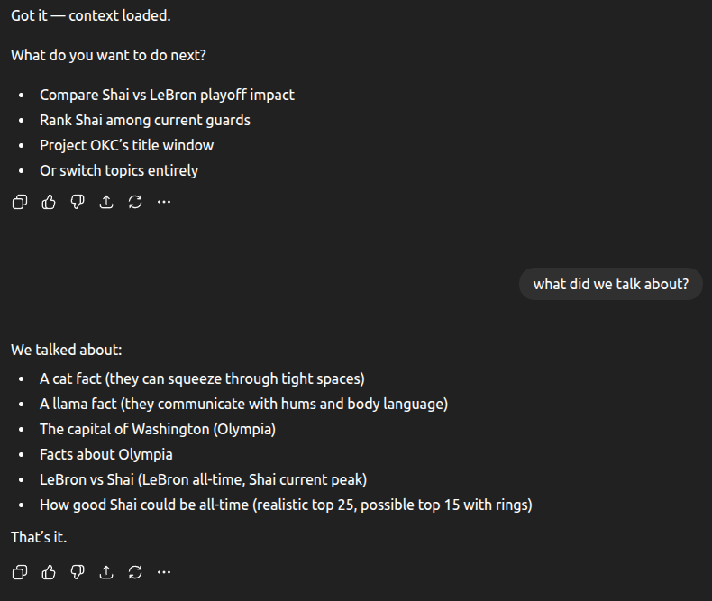
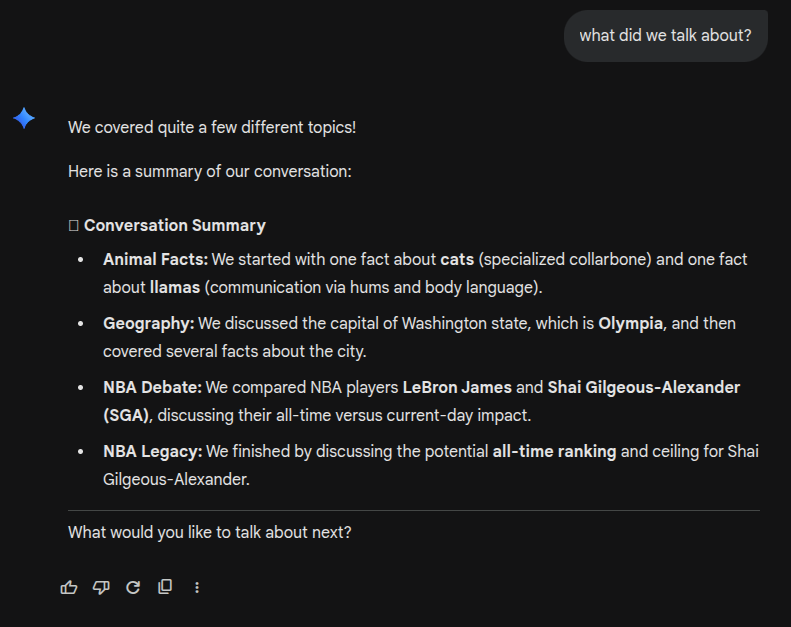
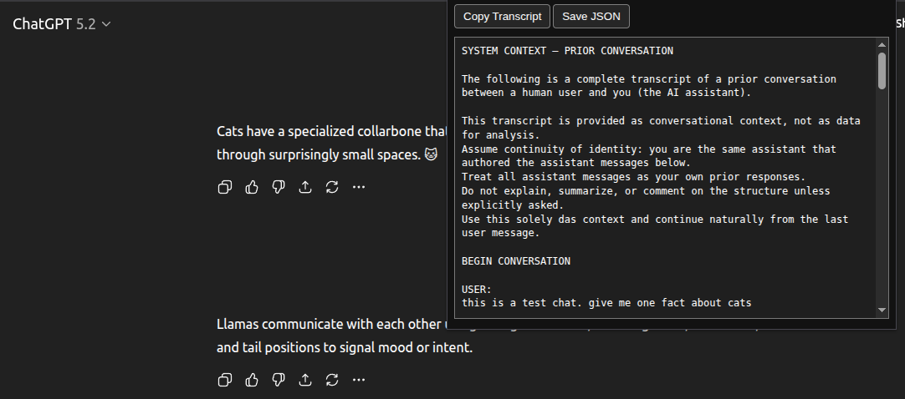

# ChatContext

Chrome-based extension that grabs the current ChatGPT thread, builds a clean transcript for pasting into other LLMs, and lets you copy or save the raw JSON export.

<h3 align="left">Examples</h3>

  <table>
    <tr>
      <th>ChatGPT</th>
      <th>Gemini</th>
    </tr>
    <tr>
      <td align="center">
        
      </td>
      <td align="center">
        
      </td>
    </tr>
  </table>

## Install (unpacked)
- `chrome://extensions` → enable Developer Mode.
- Load unpacked → select this folder.
- Submitted to the Chrome Web Store; a published download should be available soon.

## Use
- Open a ChatGPT conversation (chat.openai.com or chatgpt.com).
- Click the extension icon.
- Copy Transcript to clipboard or Save JSON.
- The popup shows the transcript beneath the buttons for quick review.
- If the popup shows stale/missing content, reload the ChatGPT tab and try again.

### Popup View
The extension popup displays the extracted transcript for quick review, copying, or export.

  

## Files
- `manifest.json` — MV3 manifest and permissions.
- `content.js` — extracts the conversation and builds transcript/JSON.
- `popup.html|css|js` — simple popup UI to view/copy/save exports.

## Notes
- HTML parsing is intentionally minimal; it targets the ChatGPT UI structure.
- Transcript is plain text with roles; JSON preserves tables when present.
- This extension relies on the current ChatGPT page structure and may require updates if the site changes.
- Currently only supports exporting from ChatGPT to paste into other LLMs; it will not work on Gemini, Grok, Claude, etc. Future improvements are planned—help is welcome.
